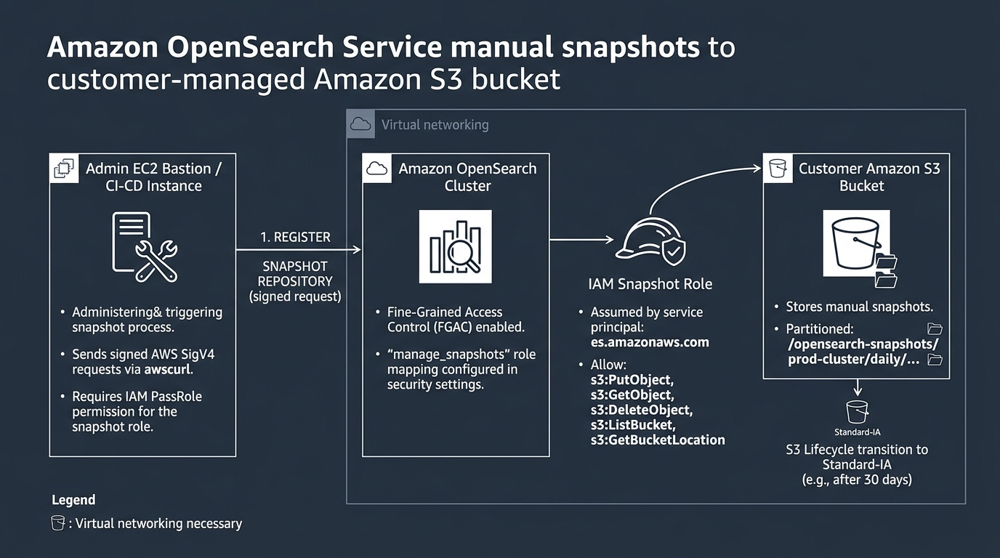
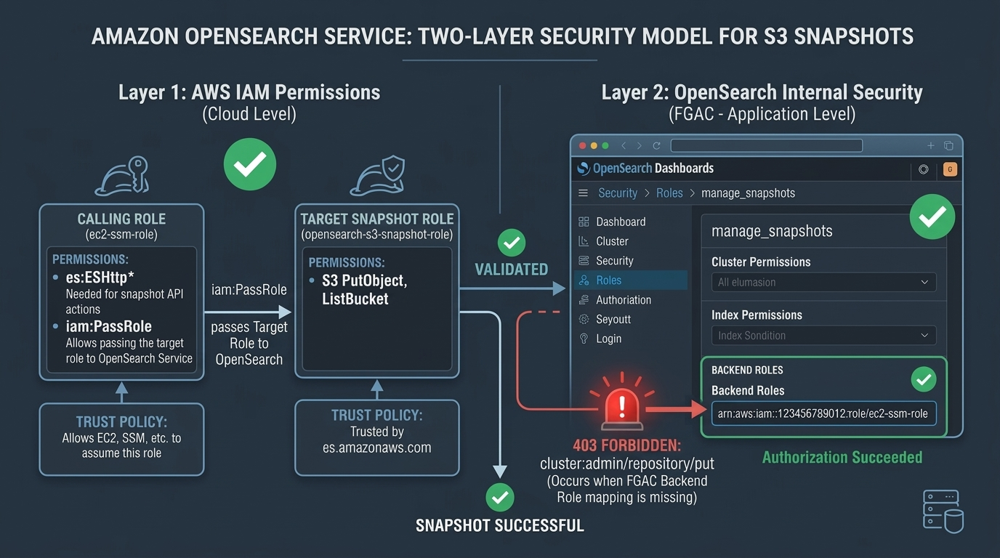
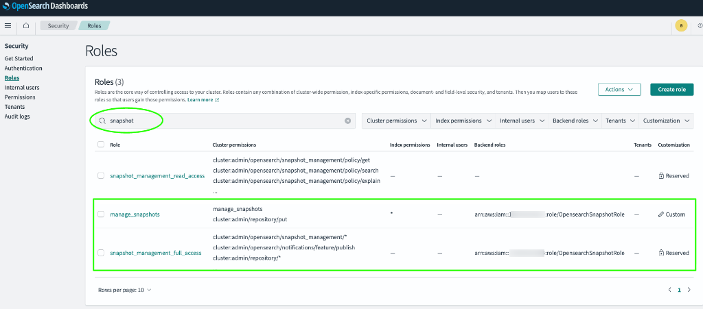

# Why AWS Automated Snapshots Aren't Enough: How to Automate OpenSearch Backups to Your Own S3 Bucket

Most engineering teams running Amazon OpenSearch Service assume their backups are covered. AWS takes hourly snapshots and retains them for 14 days. It sounds like a solid safety net until you face a real operational crisis.

We discovered this when compliance requested cluster audit logs from three months prior—only to find AWS had already purged them. Worse yet, if an engineer accidentally deletes your OpenSearch domain tomorrow, every automated snapshot vanishes right along with it.

AWS managed snapshots come with four critical blind spots:

- **Zero visibility:** Files live in a hidden AWS-owned bucket you cannot inspect or download.
- **No portability:** You cannot restore snapshots across AWS accounts or regions for disaster recovery.
- **Hard 14-day limit:** Historical audit and compliance logs past two weeks are permanently gone.
- **Domain lock-in:** If the cluster is deleted, all backups disappear with it instantly.

Relying solely on AWS managed backups is a serious operational risk. The only real solution is streaming manual snapshots directly into an S3 bucket you own. Here is our production setup: configuring IAM roles, solving the infamous FGAC 403 Forbidden error, putting daily snapshots on autopilot without Lambda, and safely testing restores.

---

## How OpenSearch Talks to S3

Backing up OpenSearch doesn't require sidecars or external cron daemons. OpenSearch includes a native S3 repository plugin built directly into its engine.

When you trigger a snapshot, OpenSearch's cluster manager assumes an IAM role you designate, connects directly to your S3 bucket endpoint, and streams Lucene index segments into your folder prefix.



Making this handshake work in production requires three authentication components:

- **Snapshot IAM Role:** An AWS role trusted by OpenSearch (`es.amazonaws.com`) with S3 read/write access.
- **Bastion Execution Role:** The machine sending API calls, requiring [`iam:PassRole`](https://docs.aws.amazon.com/IAM/latest/UserGuide/id_roles_use_passrole.html) on the snapshot role.
- **OpenSearch Fine-Grained Access Control (FGAC):** Role mappings authorizing your IAM identity to manage repositories under [FGAC](https://docs.aws.amazon.com/opensearch-service/latest/developerguide/fgac.html).

---

## Step 1: Set Up Your S3 Bucket (And Avoid the Glacier Trap)

Create a dedicated S3 bucket (e.g., `my-opensearch-backup-bucket`). There is one strict rule: the bucket must reside in the **exact same AWS region** as your OpenSearch domain.

In private VPCs, traffic reaches S3 via VPC Gateway Endpoints. These endpoints are strictly regional and cannot route cross-region. If your cluster is in `eu-west-1` and the bucket is in `us-east-1`, registration fails with `Status Code: 301`.

Enable standard `SSE-S3` encryption.

### Don't Fall into the S3 Glacier Trap

Engineers often try to cut costs by pushing snapshots to Glacier after 7 days. **Do not do this.**

OpenSearch requires random, millisecond read access to repository metadata and index chunks. If files are archived in Glacier, repository checks fail, snapshots hang, and restores time out.

**The recommended approach:**

- Keep active snapshots in **S3 Standard** for 30 days.
- Transition objects under `opensearch-snapshots/` to [**S3 Standard-Infrequent Access (Standard-IA)**](https://docs.aws.amazon.com/AmazonS3/latest/userguide/storage-class-intro.html) after 30 days.

Standard-IA saves roughly 40% on storage while preserving immediate millisecond retrieval.

---

## Step 2: Configure the Two Essential IAM Roles

You need two IAM roles: one for OpenSearch, and one for the bastion host executing registration commands.

### 1. Cluster Snapshot Role (`opensearch-s3-snapshot-role`)

OpenSearch needs permissions to write to S3. Create a role with this trust policy:

```json
{
"Version": "2012-10-17",
"Statement": [
{
"Effect": "Allow",
"Principal": { "Service": "es.amazonaws.com" },
"Action": "sts:AssumeRole"
}
]
}
```

Attach an inline policy granting permissions on your bucket and prefix:

```json
{
"Version": "2012-10-17",
"Statement": [
{
"Effect": "Allow",
"Action": ["s3:ListBucket"],
"Resource": ["arn:aws:s3:::my-opensearch-backup-bucket"],
"Condition": {
"StringLike": { "s3:prefix": ["opensearch-snapshots/*", "opensearch-snapshots"] }
}
},
{
"Effect": "Allow",
"Action": ["s3:GetObject", "s3:PutObject", "s3:DeleteObject"],
"Resource": ["arn:aws:s3:::my-opensearch-backup-bucket/opensearch-snapshots/*"]
}
]
}
```

The `s3:prefix` condition allows OpenSearch to validate the bucket while restricting writes to the snapshot directory.

### 2. Bastion Host Execution Role

You run setup calls from an EC2 bastion in the same VPC. That machine needs an IAM role to query OpenSearch and pass the snapshot role:

```json
{
"Version": "2012-10-17",
"Statement": [
{
"Effect": "Allow",
"Action": ["es:ESHttpPut", "es:ESHttpGet", "es:ESHttpPost"],
"Resource": ["arn:aws:es:us-east-1:123456789012:domain/my-opensearch-cluster/*"]
},
{
"Effect": "Allow",
"Action": "iam:PassRole",
"Resource": "arn:aws:iam::123456789012:role/opensearch-s3-snapshot-role"
}
]
}
```

Without `iam:PassRole`, AWS blocks your bastion from passing the role to OpenSearch, rejecting the request before it reaches the cluster.

---

## Step 3: Solving the 403 Forbidden Error (OpenSearch FGAC)

This is where most engineers hit a wall. After creating both roles, running the registration request from your bastion returns:

```json
{
"error": {
"root_cause": [{
"type": "security_exception",
"reason": "no permissions for [cluster:admin/repository/put] and User [name=arn:aws:iam::123456789012:role/ec2-ssm-role, ...]"
}],
"type": "security_exception",
"status": 403
}
}
```

Even with AWS `AdministratorAccess`, OpenSearch still rejects the request.



Under **Fine-Grained Access Control (FGAC)**, AWS IAM only authenticates identity. OpenSearch's internal security plugin handles authorization. You must explicitly map your bastion's IAM role ARN into two built-in OpenSearch roles:

- `manage_snapshots`: Permits repository registration and manual snapshots/restores.
- `snapshot_management_full_access`: Permits creating automated Snapshot Management policies.

### Mapping Backend Roles in OpenSearch Dashboards

- Log into OpenSearch Dashboards as master admin.
- Navigate to **Security** → **Roles**.
- Find `manage_snapshots`, click the **Mapped users** tab, and click **Manage mapping**.
- Under **Backend roles**, paste your bastion execution role ARN (e.g., `arn:aws:iam::123456789012:role/ec2-ssm-role`) and click **Map**.
- Repeat the exact same mapping for `snapshot_management_full_access`.



---

## Step 4: Register the S3 Repository Using awscurl

Because OpenSearch requires [AWS Signature Version 4 (SigV4)](https://docs.aws.amazon.com/general/latest/gr/signing_aws_api_requests.html) authentication, standard `curl` calls fail. Install [`awscurl`](https://github.com/okigan/awscurl) on your bastion to sign requests using your instance credentials:

```bash
sudo yum install python3 python3-pip -y
sudo pip3 install awscurl
```

Register your repository:

```bash
awscurl -XPUT "https://search-my-opensearch-domain-xxxxxx.us-east-1.es.amazonaws.com/_snapshot/daily-snapshots"   --service es   --region us-east-1   -H 'Content-Type: application/json'   -d '{
"type": "s3",
"settings": {
"bucket": "my-opensearch-backup-bucket",
"base_path": "opensearch-snapshots/prod-cluster/daily",
"region": "us-east-1",
"endpoint": "s3.us-east-1.amazonaws.com",
"role_arn": "arn:aws:iam::123456789012:role/opensearch-s3-snapshot-role"
}
}'
```

**Two Crucial Gotchas:**

- **No Trailing Slash on `base_path`:** Never end `base_path` with a slash (use `opensearch-snapshots`, not `opensearch-snapshots/`). OpenSearch creates paths with double slashes (like `//tests-xyz/master.dat`), failing verification.
- **The S3 301 Error:** If your call returns `Status Code: 301`, your bucket is in another region. Because VPC Gateway Endpoints cannot route cross-region, recreate the bucket in the same region.

Verify that your cluster and S3 bucket are connected:

```bash
awscurl -XGET "https://search-my-opensearch-domain-xxxxxx.us-east-1.es.amazonaws.com/_snapshot/_all"   --service es   --region us-east-1
```

A response of `{"daily-snapshots":{"type":"s3", ...}}` confirms your cluster and S3 bucket are linked.

---

## Step 5: Put Daily Snapshots on Autopilot (Skip the Lambda Functions)

Historically, automating snapshots required EventBridge rules, custom Lambda functions, and retention scripts. You don't need any of that now. OpenSearch includes a native [Snapshot Management (SM)](https://opensearch.org/docs/latest/tuning-your-cluster/availability-and-recovery/snapshots/snapshot-management/) plugin that schedules and rotates snapshots on-cluster:

```bash
awscurl -XPOST "https://search-my-opensearch-domain-xxxxxx.us-east-1.es.amazonaws.com/_plugins/_sm/policies/daily-snapshot-policy"   --service es   --region us-east-1   -H 'Content-Type: application/json'   -d '{
"description": "7-day rolling S3 snapshot policy",
"creation": {
"schedule": {
"cron": {
"expression": "0 20 * * *",
"timezone": "UTC"
}
},
"time_limit": "1h"
},
"deletion": {
"schedule": {
"cron": {
"expression": "0 21 * * *",
"timezone": "UTC"
}
},
"condition": {
"max_age": "7d",
"max_count": 7,
"min_count": 1
},
"time_limit": "1h"
},
"snapshot_config": {
"repository": "daily-snapshots",
"indices": "*",
"date_format": "yyyy-MM-dd-HH-mm",
"timezone": "UTC",
"include_global_state": true
}
}'
```

*(Note: Always include `"timezone": "UTC"` in both cron schedules. Omitting timezone triggers an internal Java `NullPointerException` on OpenSearch 2.x clusters).*

OpenSearch now captures snapshots every evening at 20:00 UTC and purges snapshots older than 7 days at 21:00 UTC—fully automated without external cron services.

---

## Step 6: Safely Test Restores (Without Clobbering Production Data)

An untested backup is just wishful thinking. Run restore tests in **OpenSearch Dashboards → Dev Tools** (Console) or via `awscurl`.

To avoid overwriting live data, use regex pattern renaming in the [Snapshot Restore API](https://docs.aws.amazon.com/opensearch-service/latest/developerguide/managedomains-snapshots.html#managedomains-restore-snapshots):

### 1. Trigger an on-demand snapshot:

```json
PUT _snapshot/daily-snapshots/manual-test-snapshot
{
"indices": "application-logs-*,service-logs-*",
"ignore_unavailable": true,
"include_global_state": false
}
```

*(Tip: Use `"indices": "*,-.*"` to snapshot all user indices while skipping internal dot-prefixed system indices).*

### 2. Restore using pattern renaming:

Restore matching indices with a dynamic suffix rather than listing them individually:

```json
POST _snapshot/daily-snapshots/manual-test-snapshot/_restore
{
"indices": "application-logs-*",
"rename_pattern": "(.+)",
"rename_replacement": "$1_restored",
"include_global_state": false
}
```

OpenSearch rehydrates chunks from S3 into `*_restored` indices. Verify document counts with `GET _cat/indices/*restored*?v`, then delete test indices (`DELETE *restored`) without touching production data.

---

## Production Lessons from the Field

- **Structure S3 Paths Cleanly:** Use clear prefixes like `opensearch-snapshots/&lt;env&gt;/&lt;cluster&gt;/`. This simplifies audits and S3 replication.
- **Consolidate Tiny Shards:** Snapshots process data per shard. Thousands of tiny shards cause CPU spikes during backups. Merge or shrink historical daily indices before archiving.
- **Cross-Account Migrations are Easy:** Because snapshots live in your S3 bucket, restoring into another AWS account requires only adding a bucket policy granting the target account's OpenSearch role read access.

---

## Final Thoughts

AWS automated snapshots provide a convenient rollback window, but customer-managed S3 snapshots give you true data ownership and cross-account disaster recovery.

All IAM policy templates, scripts, and Dev Tools commands are available on [GitHub](https://github.com/RootUserGit/opensearch-s3-snapshots).
